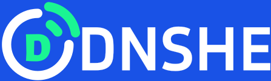
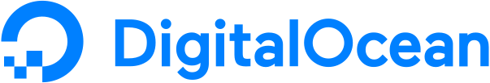

  

<h1 align="center">DNSHE 무료 도메인 서비스</h1>

간단하고 빠른 무료 도메인 등록 및 DNS 서비스. 모든 아이디어에 자신만의 인터넷 주소를 만들어 주세요.

  
  
  

<a href="./README.md">English</a> · <a href="./README_ZH.md">简体中文</a> · <a href="./README_ZH_TW.md">繁體中文</a> · <a href="./README_JA.md">日本語</a> · <a href="./README_RU.md">Русский</a> · <a href="./README_ID.md">Bahasa Indonesia</a> · <a href="./README_DE.md">Deutsch</a> · <a href="./README_FR.md">Français</a> · <strong>한국어</strong> · <a href="./README_AR.md">العربية</a>

## DNSHE 소개

DNSHE는 싱가포르의 청년 팀이 운영하는 비영리 도메인 배포 플랫폼입니다. 인터넷 콘텐츠 제작의 진입 장벽을 낮추기 위해 전 세계 개발자, 학생, 오픈 소스 커뮤니티에 무료로 쉽게 사용할 수 있는 도메인 인프라를 제공합니다.

기본 도메인 서비스는 영구 무료입니다. 신용카드나 결제 정보가 필요 없으며 도메인이나 웹사이트에 광고를 강제로 표시하지 않습니다. 개인 블로그, 포트폴리오, 오픈 소스 프로젝트, API 엔드포인트, 자동화 서비스 등에 사용할 수 있습니다.

이 저장소에서는 DNSHE 서비스 소개, 등록 안내, 도메인 접미사 정보와 API 문서 링크를 제공합니다. 도메인 등록과 DNS 관리는 [DNSHE 콘솔](https://my.dnshe.com/index.php?m=domain_hub)에서 진행합니다.

## 주요 기능

- **무료 등록 및 갱신**: 기본 서비스에 숨겨진 요금이 없습니다. 무료로 갱신하거나 친구의 도움을 받아 무료로 영구 유효 상태로 전환할 수 있습니다.
- **다양한 DNS 레코드**: A, AAAA, CNAME, MX, TXT, NS, SRV, CAA 등을 지원하여 웹사이트, 이메일, 도메인 인증에 활용할 수 있습니다.
- **네임서버 변경**: DNSHE DNS를 사용하거나 NS를 변경하여 외부 DNS 서비스에 도메인을 위임할 수 있습니다.
- **통합 관리**: 대시보드에서 도메인, DNS 레코드와 갱신을 한곳에서 관리합니다.
- **API 자동화**: 스크립트, CI/CD 및 배포 과정에서 도메인과 DNS 레코드를 관리합니다.

## 등록 가능한 접미사

공식 사이트에서는 현재 다음 네 가지 접미사를 추천합니다.

- **`.de5.net` — 기술 및 개발**: 개인 블로그, 포트폴리오, 오픈 소스 데모에 적합합니다. 예: `myproject.de5.net`.
- **`.us.ci` — CI/CD 및 서비스**: 지속적 통합, SaaS, API 엔드포인트, 테스트 환경에 적합합니다. 예: `myapi.us.ci`.
- **`.cc.cd` — 창작 및 전시**: 개인 브랜드, 디자인 스튜디오, 창작물 소개에 적합합니다. 예: `portfolio.cc.cd`.
- **`.bot.cd` — 봇 및 자동화**: AI 봇, 채팅 도우미, 웹훅, 자동화 서비스에 적합합니다. 예: `assistant.bot.cd`.

위 도메인은 이름 예시이며 등록 가능 여부를 보장하지 않습니다. 추가 접미사, 실시간 등록 가능 여부, 등록 한도 및 심사 요건은 콘솔에서 확인하세요.

## 시작하기

1. [무료 계정을 생성](https://my.dnshe.com/register.php)하거나 기존 계정으로 [로그인](https://my.dnshe.com/clientarea.php)합니다.
2. [Domain Hub](https://my.dnshe.com/index.php?m=domain_hub)에서 원하는 이름을 검색하고 접미사를 선택합니다.
3. 도메인을 등록하고 프로젝트에 필요한 A, AAAA, CNAME 등의 DNS 레코드를 추가합니다. NS를 변경하여 외부 DNS를 사용할 수도 있습니다.
4. 도메인을 웹사이트나 앱에 연결하고 호스팅 서비스의 안내에 따라 인증 및 HTTPS 설정을 완료합니다.
5. 연락 이메일을 최신 상태로 유지하고 만료 알림을 확인하여 제때 무료로 갱신합니다.

## 유효 기간 및 갱신

**서비스가 영구 무료라는 것은 모든 신규 도메인이 처음부터 갱신 없이 유지된다는 뜻이 아닙니다.** 공식 사이트 FAQ에 따르면:

- 무료 도메인의 기본 등록 기간은 **1년**입니다.
- **만료 전 180일 이내**에 무료로 갱신할 수 있습니다.
- **기능 센터 → 도메인 영구 업그레이드**(Feature Center → Permanent Domain Upgrade)에서 친구의 도움을 받아 **영구 유효 상태(갱신 불필요)**로 무료 전환할 수 있습니다.
- 만료 알림은 이메일로 발송됩니다. Telegram을 연결하고 알림을 켜면 Telegram 알림도 받을 수 있습니다.
- 규칙을 위반하면 도메인이 정지 또는 삭제될 수 있습니다. 만료 후 복구 유예 기간이 끝날 때까지 갱신하지 않으면 삭제될 수 있습니다.

도메인 상태, 갱신 방법 및 업그레이드 조건은 콘솔과 [서비스 약관](https://www.dnshe.com/tos.html)을 확인하세요.

## API 및 개발자 자료

API를 통해 도메인과 DNS 레코드를 관리하고 스크립트, 테스트 환경, 배포 파이프라인에 연결할 수 있습니다.

- [온라인 API 사용 설명서](https://my.dnshe.com/knowledgebase/1/Free-Domain-Name-Service-API-User-Manual)
- [한국어 API 문서](./docs/api_ko.md) · [영어 문서](./docs/api.md)
- [콘솔 및 API 인증 정보 관리](https://my.dnshe.com/index.php?m=domain_hub)
- [도움말 센터](https://my.dnshe.com/knowledgebase)

API 주소, 인증 방식 및 요청 제한은 최신 온라인 문서와 콘솔을 확인하세요. API Key, API Secret 및 계정 인증 정보를 안전하게 보관하고 공개 저장소에 커밋하지 마세요.

## 사용 규칙 및 악용 신고

DNSHE는 공유 인프라입니다. 피싱, 사기, 악성코드, 스팸, DDoS, 무단 스캔, 무차별 대입 공격, 프록시 악용, 차단 회피, 권리 침해 및 기타 불법 활동에 사용할 수 없습니다. 한도 우회, 재판매, 대여 및 허가 없는 계정 자원 공유도 금지됩니다.

사용자는 도메인을 통해 게시, 연결 또는 배포하는 콘텐츠와 사업 활동에 책임을 집니다. DNSHE는 보안과 서비스 운영을 위해 약관에 따라 DNS 레코드를 삭제하거나 도메인 정지, 계정 제한, 갱신 거부 조치를 취할 수 있습니다. 필요한 경우 증거를 보존하고 상위 서비스 제공업체 또는 관계 기관에 신고할 수 있습니다. 무료 서비스는 보안, 규정 준수, 운영 또는 악용 방지를 위해 제한되거나 종료될 수 있습니다.

- [서비스 약관](https://www.dnshe.com/tos.html) · [개인정보 처리방침](https://www.dnshe.com/privacy.html)
- [악용 신고 센터](https://www.dnshe.com/domainabuse/) · [abuse@dnshe.com](mailto:abuse@dnshe.com)

신고 시 도메인, 악용 유형, 관련 URL, 증거 및 연락 이메일을 제공해 주세요.

## 문의 및 지원

- **계정, 도메인, DNS 및 API 문의**: [support@dnshe.com](mailto:support@dnshe.com)
- **공식 소식**: [X / @dnshecom](https://x.com/dnshecom)
- **프로젝트 후원**: [DNSHE 후원하기](https://www.dnshe.com/sponsor.html)

DNSHE가 프로젝트에 도움이 되었다면 이 저장소에 Star를 남겨 주세요. 서버, 대역폭, 도메인 등의 자원 지원도 환영합니다. 장기 협력은 이메일로 문의해 주세요.

## 파트너 및 후원사

DNSHE의 무료 도메인 및 DNS 인프라를 지원해 주시는 파트너 여러분께 감사드립니다. 나열 순서는 순위를 의미하지 않습니다.

  
  &nbsp;&nbsp;&nbsp;&nbsp;
  

  <a href="https://www.digitalocean.com/">DigitalOcean</a> · <a href="https://alphavps.com/">AlphaVPS</a>

<a href="https://www.dnshe.com/sponsor.html">파트너 참여 / DNSHE 후원</a> · <a href="mailto:support@dnshe.com">협력 문의</a>

